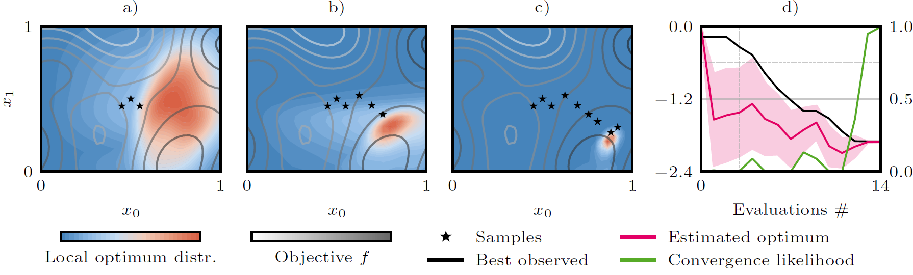

# Local Entropy Search over Descent Sequences for Bayesian Optimization - Supplementary Material

This repository contains the supplementary code for the ICLR paper titled "Local Entropy Search over Descent Sequences for Bayesian Optimization". It can be used to reproduce the experimental results.

## Overview



Illustration of Local Entropy Search (LES) on a 2D example: a) After three initial evaluations, the distribution
over reachable local optima is wide. b, c) As LES selects new points, evaluations concentrate near
the descent sequence, and the distribution of the local optimum narrows. d) Convergence behavior of
LES. After 14 evaluations, the convergence criterion (see Appx. E.1) stops the optimization..

> [!TIP]
> A re-implentation of LES is now available in [BoTorch](https://botorch.org/). The acquistion function is implemented [here](https://github.com/meta-pytorch/botorch/blob/main/botorch_community/acquisition/local_entropy_search.py) and a short tutorial notebook can be found [here](https://github.com/meta-pytorch/botorch/blob/main/notebooks_community/local_entropy_search/local_entropy_search.ipynb).

You can find the paper on [OpenReview](openreview.net/forum?id=cPxmLZmFa7) and a preprint is available on [arXiv](https://arxiv.org/abs/2511.19241).

## Citation
If you find our code or paper useful, please consider citing

```
@inproceedings{stenger2026local,
      title={Local Entropy Search over Descent Sequences for Bayesian Optimization},
      author={David Stenger and Armin Lindicke and Alexander von Rohr and Sebastian Trimpe},
      booktitle={The Fourteenth International Conference on Learning Representations},
      year={2026},
      url={https://openreview.net/forum?id=cPxmLZmFa7}
}
```


## Abstract 


Searching large and complex design spaces for a global optimum can be infeasible and unnecessary. A practical alternative is to iteratively refine the neighborhood of an initial design using local optimization methods such as gradient descent. We propose local entropy search (LES), a Bayesian optimization paradigm that explicitly targets the solutions reachable by the descent sequences of iterative optimizers. The algorithm propagates the posterior belief over the objective through the optimizer, resulting in a probability distribution over descent sequences. It then selects the next evaluation by maximizing mutual information with that distribution, using a combination of analytic entropy calculations and Monte-Carlo sampling of descent sequences. Empirical results on high-complexity synthetic objectives and benchmark problems show that LES achieves strong sample efficiency compared to existing local and global Bayesian optimization methods.


## Dependencies:

- The conda_env.yaml file contains most dependencies. Note that we did not use the newest BoTorch version.
- The GPflowSampling sampling code is linked via a git submodule (see .gitmodules)
- The original GIBO repository is located in benchmarking/gibo
- All experiments were conducted using python 3.12.7 

## Main Code Files:

- The local entropy search code is located in local_bo/local_bo/optimization/local_bo.py.
- The file benchmarking/benchmarking.py is the main file used for benchmarking. It interfaces the local entropy search code, all baselines and the objective functions.
- The folder notebooks contains the main notebooks for post processing.

## Reproducing the Results:

To run the benchmarks run the benchmarking python file with the following command line arguments:

```bash
python benchmarking/benchmarking.py <index> <obj_name> <target_folder> <algorithms> <within_model> <hypeprior>   
```

- \<index\>: integer - for the conversion from index to seed and problem dimension please refer to lines 320-324 of benchmarking py
- \<obj_name\>: name of the objective function
- \<target_folder\>: location where results are saved to
- \<algorithms\>: list of algorithms to evaluate
- \<within_model\>: True if ground truth GP hyperparameters should be used - only applicable if \<obj_name\> is gp_sample 
- \<hypeprior\>: 1: high complexity, 2: medium complexity, 3: low complexity. 4: extremely low complexity -2: Box hyperprior on length scales (used for the other benchmarks) 


Below you can find some examples of how to run the benchmarks:

For within model comparison on 20 seeds with medium complexity the following should be run:
```
python benchmarking/benchmarking.py {1-100} gpsample results_folder "('turbo','sobol','les_250_8','logei','hci_gibo','mes')"  True 2
```

For out-of-model comparison on 20 seeds with high complexity the following should be run:
```bash
python benchmarking/benchmarking.py {1-100} gpsample results_folder "('turbo','sobol','les_250_8','logei','loghvarei','hci_gibo','mes')"  False 1
```

And for the synthetic and policy search benchmarks with 10 samples the following should be ran:

```bash
python benchmarking/benchmarking.py {1-10} {ackley,dixonprice,lunar,rover_trajectory,mopta08,square} results_folder "('turbo','sobol','les_250_8','logei','hci_gibo','mes')"  False -2 
```

Parenthesis {} mean that the command should be executed for all of the elements. We parallelized the evaluation with slurm scripts.


